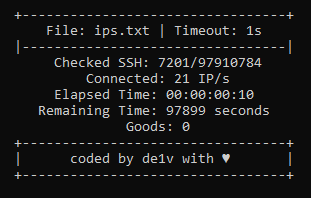

## my old bruter, do what you want

# Bruter

A concurrent SSH brute force tool written in Go.



### note
- Remaining time is if all IPs timeout!

## Features

- Multi-threaded SSH connection attempts
- Configurable timeout and concurrency settings
- Support for custom wordlists (usernames, passwords, IPs)
- Real-time progress monitoring
- Saves successful logins to `vuln.txt`

## Usage

1. Build the project:
    ```sh
    make build
    ```
2. Run the tool:
    ```sh
    make run
    ```
3. When prompted, enter:
    ```
    Path to usernames file (default: usernames.txt)
    Path to passwords file (default: passwords.txt)
    Path to IPs file (default: ips.txt)
    Timeout in seconds (default: 5)
    Number of concurrent connections (default: 1000)
    ```

## Requirements

- Go 1.22 or higher
- Make

## License

This project is open source and available under the MIT License.

## Author

Created by de1v (https://github.com/mrde1v)
